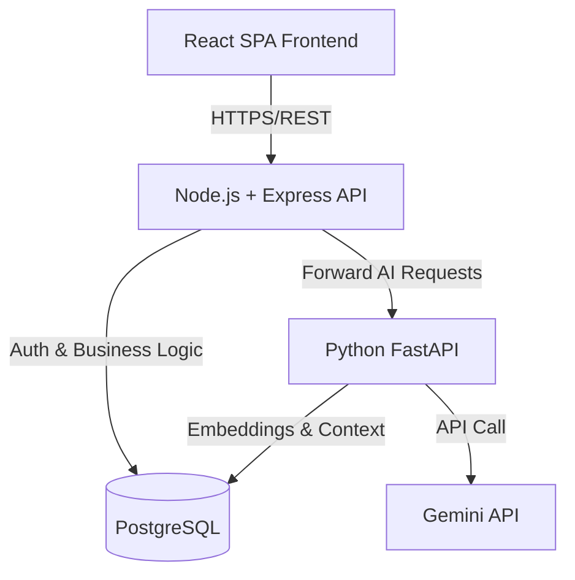
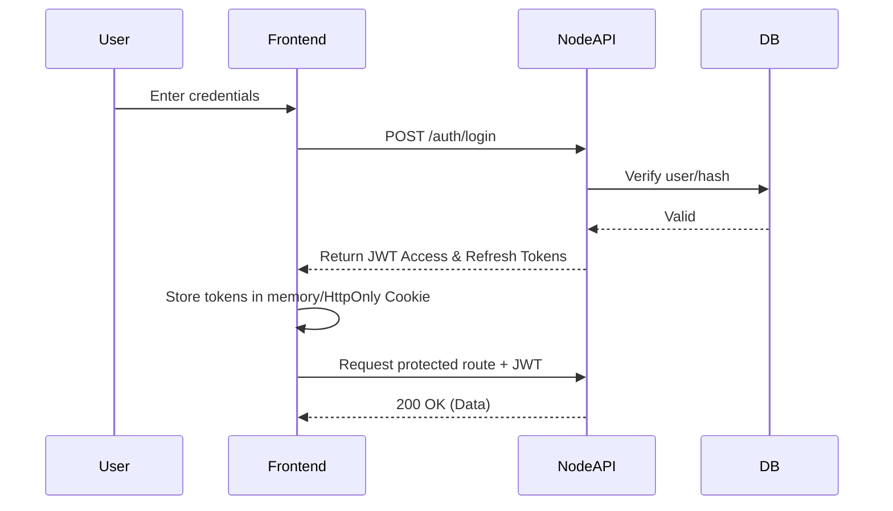

# System Architecture

## 1. Complete System Architecture
The application uses a polyglot microservices approach to leverage the best tools for web serving and AI processing.

### Technology Decisions Rationale
* **Frontend (React/TypeScript):** Industry standard, great for complex state (like chat and quizzes). TypeScript prevents runtime bugs.
* **Backend (Node.js/Express):** Fast, non-blocking I/O perfect for handling many concurrent user requests and DB operations.
* **AI Service (FastAPI):** Python is the lingua franca of AI. FastAPI is incredibly fast and native async. Separating this from Node.js prevents heavy AI tasks from blocking the web server.
* **Database (PostgreSQL + pgvector):** Storing user data and vector embeddings in the *same* database simplifies architecture significantly. No need for a separate vector DB.

## 2. Frontend Architecture
* **Framework:** React + Vite (for fast HMR and build times).
* **State Management:** React Context (for Auth/User state) + React Query (for API data fetching & caching).
* **Styling:** Tailwind CSS (utility-first, standard for modern dashboards).
* **Components:** Atomic design pattern (Atoms -> Molecules -> Organisms -> Templates -> Pages).

## 3. Backend Architecture (Node.js)
* **Architecture:** MVC (Model-View-Controller) / layered architecture (Routes -> Controllers -> Services -> Repositories).
* **Role:** Handles users, auth, document metadata, quiz results, and acts as a gateway to the AI service.

## 4. AI/RAG Architecture (FastAPI)
* **Role:** Handles document parsing, chunking, embedding generation, semantic search, and LLM orchestration.
* **Tools:** LangChain or LlamaIndex (for orchestration), PyMuPDF (extraction).

## 5. Authentication Flow

## 6. PDF Processing & RAG Pipeline
This is the core of the study assistant.

### The Pipeline Explained:
1. **PDF:** The user uploads a document.
2. **Text Extraction:** Using PyMuPDF, we extract raw text from the pages.
3. **Cleaning:** We remove extraneous whitespace, headers, footers, and normalize the text.
4. **Chunking:** Text is split into overlapping chunks (e.g., 1000 characters with 200 overlap). Overlap ensures context isn't lost at the boundaries.
5. **Embeddings:** Each chunk is sent to an embedding model to be converted into a dense vector (an array of numbers representing semantic meaning).
6. **Vector Storage:** These vectors are saved in PostgreSQL using the `pgvector` extension alongside the original text and document ID.
7. **Similarity Search:** When a user asks a question, the question is embedded, and we query PostgreSQL for the closest vectors using cosine similarity.
8. **Relevant Context:** The top 3-5 most relevant text chunks are retrieved.
9. **Gemini:** We construct a prompt: *"Answer the user's question using ONLY the following context. Context: [Chunks] Question: [User Query]"*.
10. **Answer with Sources:** Gemini generates the answer, and we return it to the frontend along with the page numbers/sources of the chunks used.

## 7. Security Architecture
* **Passwords:** Hashed using `bcrypt` (salt rounds = 10).
* **APIs:** Protected via JWT middleware.
* **CORS:** Strictly configured to only allow the frontend origin.
* **Rate Limiting:** Applied to AI endpoints to prevent abuse and API cost overruns.
* **Data Isolation:** Every database query includes `WHERE user_id = ?` to ensure users only see their own data.

## 8. Deployment Architecture (Target)
* **Frontend:** Vercel or Netlify.
* **Node Backend:** Render, Railway, or AWS EC2.
* **Python Backend:** Render or AWS EC2.
* **Database:** Supabase (provides managed Postgres with pgvector out of the box) or AWS RDS.
