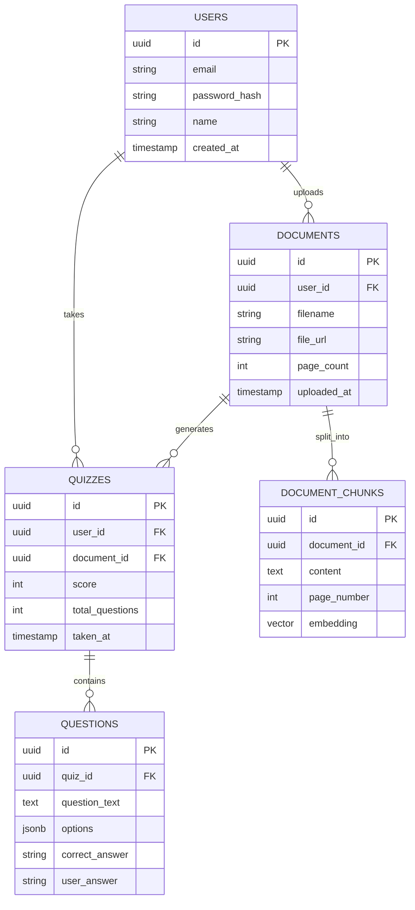

# Database Design (PostgreSQL + pgvector)

## 1. Entity Relationship (ER) Diagram

## 2. Schema Details
* **`users`**: Manages authentication.
* **`documents`**: Metadata for uploaded files.
* **`document_chunks`**: This is the core RAG table. The `embedding` column uses the `vector` type provided by `pgvector`. We will create an HNSW index on this column for hyper-fast semantic search.
* **`quizzes` & `questions`**: Tracks user assessments and performance to power the analytics dashboard.
